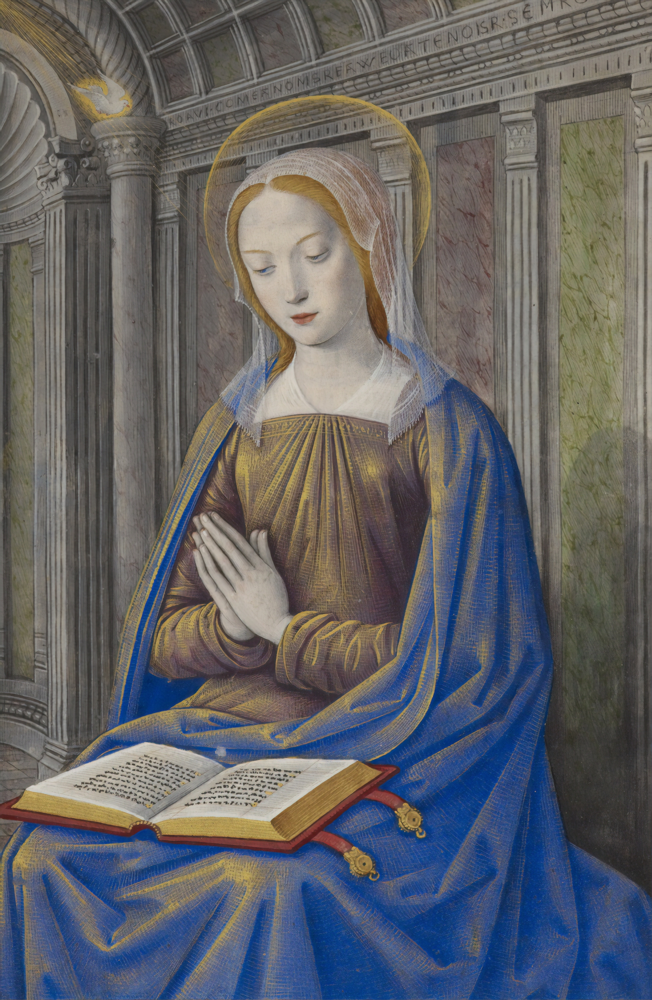

# Bem-vindos

O projeto **Maria Músicas** quer ser um contributo para promover a música religiosa no âmbito da Igreja Católica.

## Download PDFs





## Conhece melhor a nossa ideia

A nossa aposta consiste em consolidar **uma base de dados única** com muitas músicas em várias línguas.

Estas músicas podem ser usadas de diferentes formas, segundo a necessidade e uso de cada comunidade, tanto em celebrações litúrgicas como na oração pessoal.




Visitar página técnica do Vim em Github:[  
https://github.com/mariamusicas/vim](https://github.com/mariamusicas/vim)



Visitar guia das letras e ortografia  
[https://github.com/mariamusicas/docs/blob/master/letras.md](https://github.com/mariamusicas/docs/blob/master/letras.md)


A base de dados _oficial_ está guardada em **Schoenstatt Music.**


Visitar Schoenstatt Music:  
[https://schoenstatt.link/en/music](https://schoenstatt.link/en/music)



Contacto:  
mariamusicas[@](mailto:mariamusicas@padres-schoenstatt.pt)padres-schoenstatt.pt


