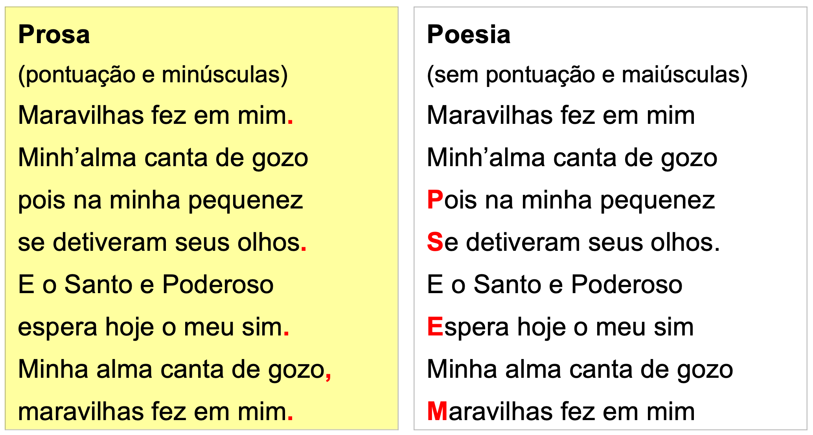

# Letras

## Correcção da ortografia

- Em prosa (versus poesia)
- Uso de maiúsculas e minúsculas

### Em prosa (versus poesia)

> Maravilhas fez em mim. Minh’alma canta de gozo pois na minha pequenez se detiveram seus olhos. E o Santo e Poderoso espera hoje o meu sim. Minha alma canta de gozo, maravilhas fez em mim.

| Prosa (pontuação e minúsculas) | Poesia (sem pontuação e maiúsculas) |
| - | - |
| Maravilhas fez em mim. | Maravilhas fez em mim |
| Minh’alma canta de gozo | Minh’alma canta de gozo |
| pois na minha pequenez | ***P***ois na minha pequenez |
| se detiveram seus olhos. | ***S***e detiveram seus olhos. |
| E o Santo e Poderoso | E o Santo e Poderoso |
| espera hoje o meu sim. | ***E***spera hoje o meu sim |
| Minha alma canta de gozo, | Minha alma canta de gozo |
| maravilhas fez em mim. | ***M***aravilhas fez em mim |

## As pessoas divinas

| Nomes, pronomes e  adjetivos | Exemplo |
| ----------------------------------- | -------------------------------------------------------- |
| **Nomes próprios** com maiúscula... | Deus, Jesus, Maria, Senhor, Espírito Santo, Jesus Cristo |
|...e títulos divinos em substituição do nome  | Salvador, Santo, Mãe, Filho  |
| **Pronomes** em maiúscula só quando são sujeito (ou mantêm a forma de sujeito) | Eu, Tu, Ele, Ela, Vós; por Ele, com Ele |
| Pronomes em minúsculas nos outros casos | sua, minha Mãe, entregar-lhe, adorá-lo |
| Pronomes em minúscula quando estão compostos com o artigo | contigo, consigo, convosco |
| **Adjetivos** sempre em minúscula | boa Mãe, bom Pastor, Espírito Santo consolador, Pai santo |

